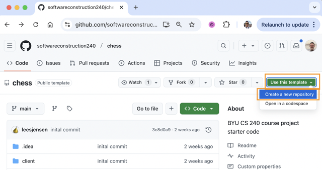
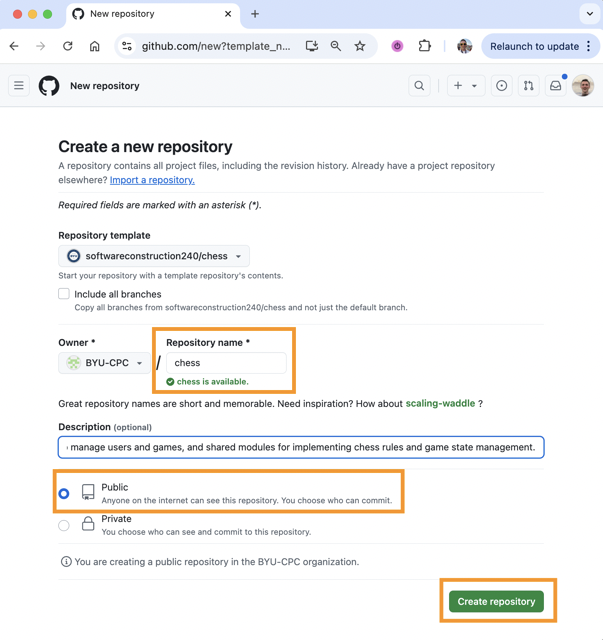

# ♕ Chess GitHub Repository

- 🖥️ [Videos](#videos)

In the following phases of the chess project you will add to, and enhance, the content you have created in a GitHub repository. The commit history that you establish through the course serves the following valuable purposes:

1. **Backup** - Every semester at least one student's computer dies. Having the ability to clone the repo to a new computer could save your grade in the course.
1. **Portfolio** - The code you develop in this course serves as a valuable portfolio artifact that you can use to demonstrate your mastery to future employers.
1. **Proof of work** - You can demonstrate your authorship of your code by consistently, and frequently, committing your work.
1. **Exploration** - The ability to create branches allows you to continuously experiment with different ideas without losing the main thread of your development. Likewise, you can try and implement something, realize it is not working and then simply reset to your last commit.
1. **Experience** - Git is the de facto versioning system. The experience you gain in this class will help prepare you for professional work.

All of this requires that you commit often. You should get in the habit of consistently making a small stable change and then committing.

1. Verify you have the latest code (`git pull`)
1. Refactor, test, and/or implement a small portion of cohesive code (`test` `code` `test`)
1. Commit and push (`git commit` `git push`)
1. Repeat

You will be most successful in this course if you set aside time each day, or every other day, to work on the project. Those consistent work sessions should be complemented with consistent commits. If you are not creating multiple commits every workday then you are not reflecting the code management practices you need in order to be successful in a production development environment.

For all of the above reasons, it is required that you use GitHub for your chess project. Additionally, you must use it consistently and frequently.

> [!IMPORTANT]
> It is a prerequisite for all deliverables that you have at least 10 commits evenly spread across the assignment period for the deliverable.

If you do not have the required number of commits, or if they are all clustered in a single burst of activity, then you will need to justify the discrepancy before the deliverable will be accepted.

## Creating Your Chess GitHub Repository

1. Open your web browser to [GitHub](https://github.com)
1. Sign in to personal account, or create one if you don't already have a GitHub.com account. _The [GitHub Terms of Service](https://docs.github.com/en/site-policy/github-terms/github-terms-of-service#3-account-requirements) allow only one account per individual._
1. View the [chess template repository](https://github.com/softwareconstruction240/chess).
1. Use the template to create your own chess repository:
   1. Press "Use this template"
   1. Choose "Create a new Repository"

      

   1. Name it `chess`.
   1. Optionally, give it a meaningful description such as:
       > Full-stack chess application built as a course project for BYU CS 240. It features a networked client-server architecture, with a command-line client, a server to manage users and games, and shared modules for implementing chess rules and game state management.
   1. Mark the repository as `public` so that it can be reviewed by the TAs and instructors. (This is the default.)
   1. Leave the box marked `Include all branches` unchecked. (This is the default.)
   1. Press "Create Repository"

      

1. Open a command line console window.
1. Clone the repository to your development environment. Make sure you put the clone of the repository in a directory that you use for this class's coursework. These commands will look something like the following.

   ```sh
   cd ~/byu/cs240
   git clone https://github.com/YOURACCOUNTHERE/chess.git
   cd chess
   ```

## Making Changes

After you have cloned your repository locally, you need to make a change so that you can demonstrate that things are working properly.

1. Create a file in your repository directory named `notes.md`.
1. Add some content to it.
1. Add the `notes.md` file to the repo.
1. Commit the changes.
1. Push the changes to GitHub.

You can accomplish all of these changes with the following commands.

```sh
echo "# My notes" > notes.md
git add notes.md
git commit -am "initial(notes) creation"
git push
```

As you develop your chess application you should consider keeping notes about the techniques and technologies that you learn in the `notes.md` file that you have added.

## ☑ Deliverable

Create your repository, clone it to your development environment, add the `notes.md` file, and push to GitHub.

Pass off the "GitHub Repository" assignment within the course [auto-grading](https://cs240.click/) tool by selecting the assignment from the dropdown and clicking "Submit".

Before you can submit the assignment for grading, you will be asked to provide your GitHub repository URL. The URL should look something like this:

```txt
https://github.com/<youraccount>/chess
```

When you have successfully completed the assignment:
1. The AutoGrader will show a "Submission passed!" message and display your score.
2. **Your score will be automatically entered in Canvas.**
3. You will see a new item in your "Submission History" containing the notes generated during grading.
   * Click on the submission to view more details from grading
   * In future phases, you will see additional buttons to click for detailed compiler output.


## <a name="videos"></a>Videos (3:31)

> [!NOTE]
> The "Chess GitHub Repository" video shows screenshots of outdated setup information. Between timestamps 2:16 and 2:26, the instructions for an older and more complicated way of setting up the repo are shown. Read the online version for the most up-to-date instructions.
>
> Additionally, at timestamp 2:48 the video suggests that the GitHub repo url needs to be turned in to Canvas. This is outdated; however, the rest of the discussion about the role of the autograder is correct. Instead, you will submit the GitHub repo directly to the autograder as described in the latest version of the instructions.

- 🎥 [Chess GitHub Repository (3:31)](https://byu.hosted.panopto.com/Panopto/Pages/Viewer.aspx?id=9603dd36-5c9b-4705-aa3d-b169016801a3) - [[transcript]](https://github.com/user-attachments/files/17707180/CS_240_Chess_GitHub_Repository_Transcript.pdf)
- 🎥 [Creating Chess GitHub Repository (4:34)](https://www.loom.com/share/2b2dd64e7b524b3f9b396318cf140159?sid=a6c1b75f-a73f-455e-976c-ba19052117a6) - [[transcript]](../0-chess-moves/creating-chess-github-repo-transcript.txt)
